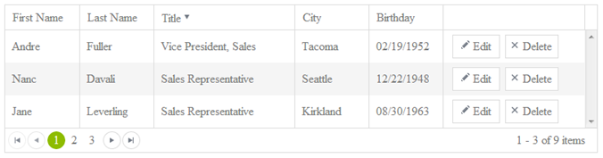
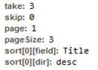
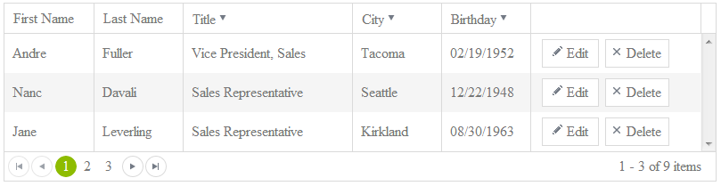

# Tutorial: Server Side Sorting

In this tutorial, you will learn how to sort server side using ASP.NET WebAPI, Kendo UI and LinqToSQL.

# Source
You can download the complete source for this article [here](https://github.com/telerik/html5-dev-for-aspnet-devs/tree/master/hello-kendo-ui-part-3).

## Written Content

I will be using the last **[Hello Kendo UI example](http://docs.kendoui.com/tutorials/ASP.NET/asp-net- hello-kendo-ui-part-2)** and applying sorting to the same project that already has paging and editing in it. There are only 3 records on a page, but we’ll pretend we have a bunch.

Open up the **Default.aspx** page and in the Grid initialization you need to turn on **sorting**.

### Turn On Paging In The Grid
	selectable: true,
    ...
    sortable: true,
    ...
    change: function (e) {

With that change, the grid is now sortable. However it’s happening client side. Of course this is fine when your grid hold 9 records but we’re trying to prove a point here. We need to get this on the server. To do that, set the **serverSorting** property on the DataSource to **true**

### Turn On Server Paging
    // do paging on the server
    serverPaging: true,
    ...

    // do sorting on the server
    serverSorting: true
    ...

Now you can sort the columns, and if you inspect the network request in the developer tools you will see that a sort parameter is being sent across.

## WebAPI Parameter Binding

You can pass any parameter into the Get request in the Controller Method and as long as it’s present, it will be automatically bound. For instance, we could now get the **take** and **skip** paging parameters directly. We do have to provide defaults though. If no values are passed, WebAPI will complain about not getting the parameter its expecting.

### Use WebAPI Default Parameter Binding
    public Models.Response Get(int take = 10, int skip = 0)
    {
        ...
    }

You might think that you could reference the **sort** parameter the same way. However, this is not the case. For starters, lets look at the structure of the object being passed.

### Sort Object
    sort[0][field]:LastName
    sort[0][dir]:asc

This object is actually rather complex. It’s an array of objects that contain a **field** and **dir** property. Right now, WebAPI sees both of these **sort** parameters as separate parameters that have a key of **sort[0][field]** and **sort[0][dir]**. That’s not exactly what we want here.

## Speaking The Same Language

What we need to do here is get Kendo UI and WebAPI on the same page. This is all about serialization. JSON is going to be the middle ground here. Kendo UI and WebAPI both read and speak JSON fluently. We essentially have two options now. We could convert just the sort objects to JSON, or we could convert the entire request to JSON and expect a single **Request** object in the **Get** controller method.

The later is used in this post because it’s a bit less verbose.

### Framework Methods

Kendo UI has a plethora of [framework methods](http://docs.kendoui.com/api/framework/kendo). One of them is **stringify**. This is a [pollyfill][http://remysharp.com/2010/10/08/what-is-a-polyfill/ (What is a Polyfill?)] for the JSON2 object. It takes an object and converts it to JSON. Most browsers support the JSON2 stringify natively, but older ones don’t. By using the **kendo.stringify** method, you will be safe in knowing that Kendo will take care of things if your browser can’t serialize to JSON.

In the **parameterMap**, you need to convert the parameters to JSON using **kendo.stringify**. You can just convert the whole **options** object.

### Convert To JSON
    if (operation === "read") {
        return kendo.stringify(options);
    }

We there is a different issue. We can’t send parameters like this to WebAPI in a **GET**. We need to do this in a **POST** and send the parameters as part of the payload. To tell Kendo UI to do this is quite easy. Just set the **type** on the **read** operation to **POST**.

### Convert To JSON
    read: {
        url: "api/employees",
        type: "POST"
    }

In the controller, you now need to have the **Get** method respond to a **POST**. By Default, WebAPI is routing it to a GET because it’s assuming that since we called it **Get**, we would want to do a **GET**.

To get around this, you need to make some routing changes. Right now, you have one simple route in the **Global.asax** application start event. You are again at a cross roads. On the one hand, you can create a route specific for this scenario the same way you created the default route. By now though, you can see that creating a new route every time you have something other than a simple set of CRUD operations is not going to scale very well. There is a better way.

## Attribute Based Routing

[Tim McCall][https://github.com/mccalltd] created an [Attribute Based Routing][http://www.strathweb.com/2012/05/attribute-based-routing-in-asp-net-web-api/] framework for MVC and then ported it for WebAPI as well. This allows you to decorate your methods with what routes you want them available at.

Go to NuGet and get the **[AttributeRouting][http://nuget.org/packages/AttributeRouting.WebApi (NuGet Gallery)]** package. Make sure you get the WebAPI one, NOT the MVC one. They are not interchangeable.

Once you have installed this package, you can get rid of the route table in the **Global.asax** file. Open the **EmployeesController** and add a reference to the **AttributeRouting** library.

### Add Attribute Routing
    using AttributeRouting.Web.Http;

> **important:** If this namespace isn’t available for you, then you probably installed the MVC version instead of the WebAPI version.

Now decorate your methods as shown:

### Decorate Methods With Routes
    [POST("api/employees")]
    public Models.Response Get(){
        ...
    }

    [POST("api/employees/{id}")]
    public HTTPResponseMessage Post() {
        ...
    }

    [DELETE("api/employees/{id}")]
    public HTTPResponseMessage Delete() {
        ...
    }

The **Get** will respond to a **POST** and the update method will only respond to a **POST** when an ID is passed in on the URI (i.e. http://localhost/api/employees/2).

> If you wanted to make this id parameter optional like it was before, you can simply put a “?” in front of it - POST(“api/employees/{?id}”). For a completely syntactical reference, have a look at [this article][http://www.strathweb.com/2012/05/attribute-based-routing-in-asp-net-web-api/].

## Back To Parameter Binding

If you remember, in the **parameterMap** method you serialized the entire **option** object to JSON. This means that in the **Get**, you are now
expecting a single object. You need to create an object that WebAPI can use to map the request parameters to. In the **Models** folder, create a * Request** class. Give it the following structure.

### Create A Request Model Object
    namespace hello_kendo_ui.Models {
        public class Request {
            public int take { get; set; }
            public int skip { get; set; }
            public int page { get; set; }
            public List<Sort> sort { get; set; }
        }

        public class Sort {
            public string field { get; set; }
            public string dir { get; set; }
        }
    }

OK, so it’s actually two classes in the same file. You can now expect one **Request** parameter in the **Get** method and all of the parameters coming from the DataSource (i.e. take, skip, page, sort) will be available off of this object. The take and skip parameters are gone and the LINQ query now references the **request** object. I also moved the **Take** and **Skip** into the body of the LINQ query for reasons I will explain shortly.

### Pass The Request Object To The Get Method
    [POST("api/employees")]
    public Models.Response Get(Models.Request request) {
        // get all of the records from the employees table in the
        // northwind database.  return them in a collection of user
        // defined model objects for easy serialization. skip and then
        // take the appropriate number of records for paging.
        var employees = (from e in _context.Employees
                        .Skip(request.skip)
                        .Take(request.take)
                        select new Models.Employee(e)).ToArray();

        // returns the generic response object which will contain the
        // employees array and the total count
        return new Models.Response(employees, _context.Employees.Count());
    }

At this point, you can test the application and you will see that it’s returning an empty dataset and a count of 9? What happened?

Since you are sending a JSON payload to WebAPI, you need to specify that you are doing that. You need to set the **contentType** in the header of the AJAX request. That sounds complicated, but since at it’s core the Kendo UI DataSource calls [jQuery.ajax()][http://api.jquery.com/jQuery.ajax/], you can pass virtually any valid **$.ajax** parameter in to the transport methods. Simply set the **contentType** to **application/json**.

### Set The Content Type To JSON
    read: {
        url: "api/employees",
        type: "POST",
        contentType: "application/json"
    },

This will give you data back. If you click on a column heading and break into the EmployeesController **Get** method, you will see that the **sort** property is now populated! You are well on your way at this point.

## Dynamic Sorting With LINQ

Since you don’t know what the sort will be at runtime, you need to be able to pass in a dynamic **OrderBy** clause to in your LINQ query. To do this, you are going to need the [Dynamic LINQ library][http://weblogs.asp.net/scottgu/archive/2008/01/07/dynamic-linq-part-1-using-the-linq-dynamic-query-library.aspx] that comes with the Visual Studio 2008 samples.

It’s just a class that you add to your project. It extends off the **System.Linq** namespace so no worries on where you put it in your project.

Once you have added it, you can import the **System.Linq.Dynamic** namespace in the **EmployeesController**.

### Import Dynamic LINQ Library
    using System.Linq.Dynamic;

This will allow you to pass a string to the **OrderBy** method. A string like “LastName asc”. It’s a standard SQL **order by** syntax. You do need to translate this out of the **sort** object and into a single string. Right now you are only passing one sort value in the 0 position of the sort object, but should you turn on multiple sorting, you will be passing 1 to many sort objects. You might do this any number of ways, but I simply iterated over the list of incoming **sort** objects and composed a string using the **string.join** method.

### Compose The Sort Query
    // compose the order by for sorting
    string order = "EmployeeID";

    // order the results
    if (request.sort != null && request.sort.Count > 0) {
        List<string> sorts = new List<string>();
        request.sort.ForEach(x => {
            sorts.Add(string.Format("{0} {1}", x.field, x.dir));
        });

        order = string.Join(",", sorts.ToArray());
    }

Notice that the sort has a default value. This is because the Dynamic LINQ query won’t respect **null** or **empty string** as a valid **OrderBy**. Also, check for a null sort object and make sure that it has a length. Before you sort, Kendo UI sends no value. On the first click, it sorts Ascendin . On the second click, it sorts Descending. On the third click it turns sorting completely off, but passes a zero length object.

### The Order Of The Order

You have an interesting scenario here if you stop to think about it. You are paging and sorting. That means that you need to do both of these, but in what order? The grid will display the current page of data. This means that when a user sorts, it should sort only the current page of data. Consequently, you need to page and then sort.

Add the OrderBy clause after the **Skip** and **Take**. This will get the right page of data, and then sort it. This is what the user expects would happen in the grid. If you sort and then page, you will be providing an unexpected user experience.

### Import Dynamic LINQ Library
    // get all of the records from the employees table in the
    // northwind database.  return them in a collection of user
    // defined model objects for easy serialization. skip and then
    // take the appropriate number of records for paging. Then order
    // that dataset with the dynamic linq query library
    var employees = (from e in _context.Employees
                     .Skip(request.skip)
                     .Take(request.take)
                     .OrderBy(order.ToString())
                     select new Models.Employee(e)).ToArray();

You’ve now got server sorting and paging in your grid.  Now you are going to set the sorting to multiple on the DataSource.

### Set Sorting To Multiple On The Grid
    editable: "inline",
    selectable: true,
    ...
    sortable: {
        mode: "multiple"
    },
    ...

Thanks to the fact that you have already accounted for the fact that the sort object is a collection, you don’t need to make any additional changes.

# Source

Grab the complete project for this article **[here][https://github.com/telerik/html5-dev-for-aspnet-devs/tree/master/hello-kendo-ui-part-3]**
